# Product Service Architecture Diagrams

## Table of Contents

1. [System Architecture](#system-architecture)
2. [Component Architecture](#component-architecture)
3. [Data Flow Diagrams](#data-flow-diagrams)
4. [Deployment Architecture](#deployment-architecture)
5. [Entity Relationships](#entity-relationships)
6. [Sequence Diagrams](#sequence-diagrams)
7. [Class Diagrams](#class-diagrams)

---

## System Architecture

### High-Level Architecture

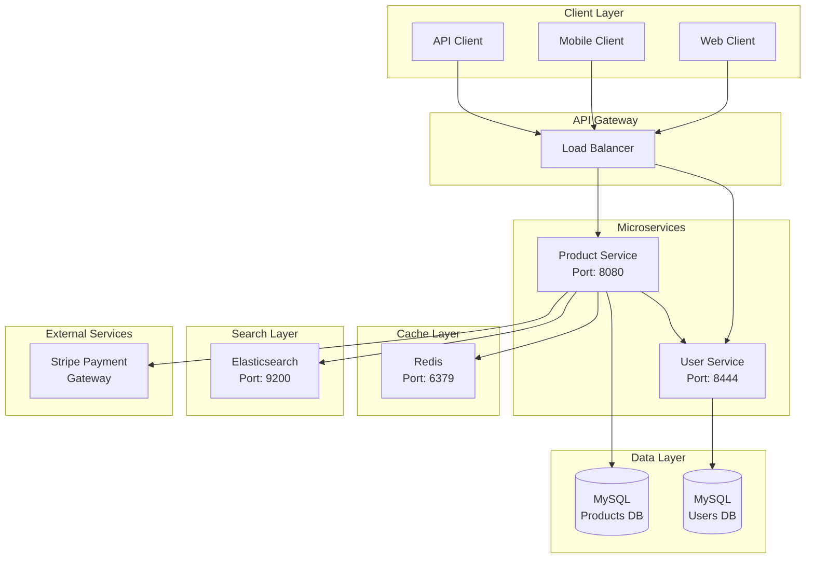

---

### Layered Architecture

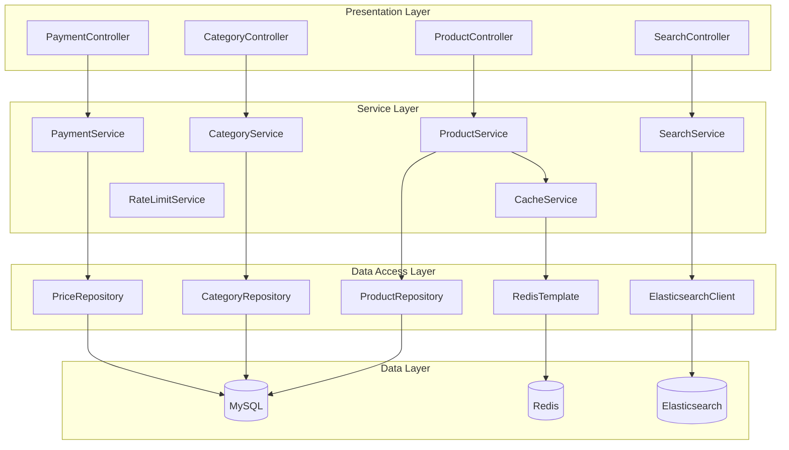

---

## Component Architecture

### Core Components

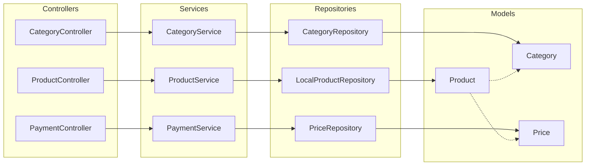

---

### Security Architecture

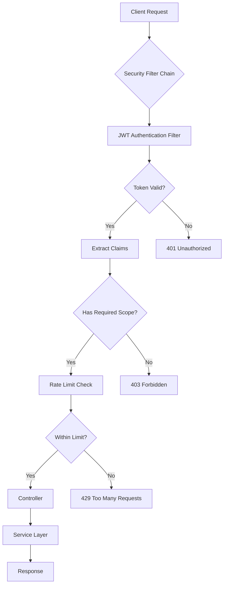

---

## Data Flow Diagrams

### Product Creation Flow

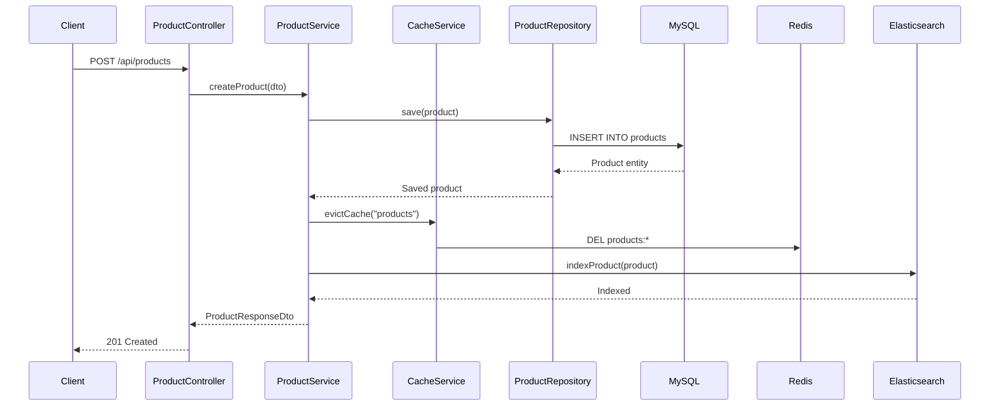

---

### Product Retrieval with Caching

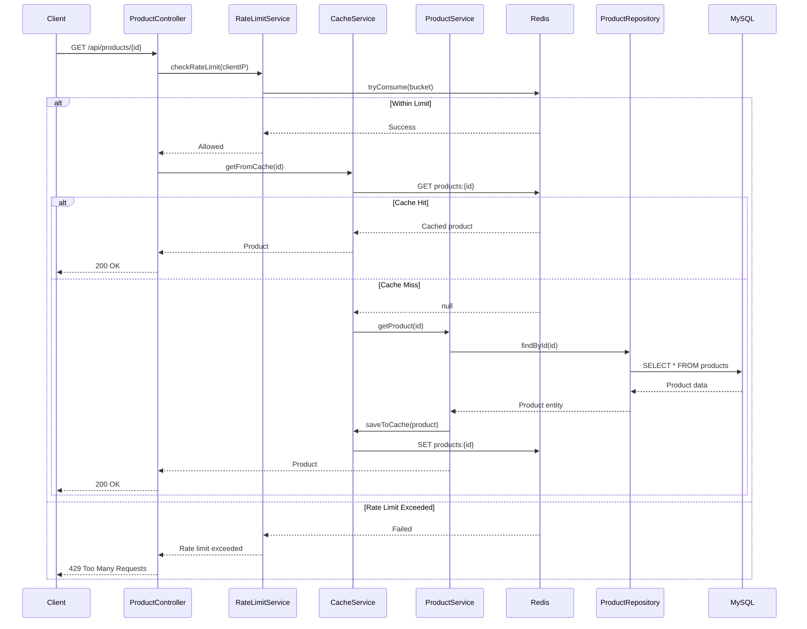

---

### Payment Processing Flow

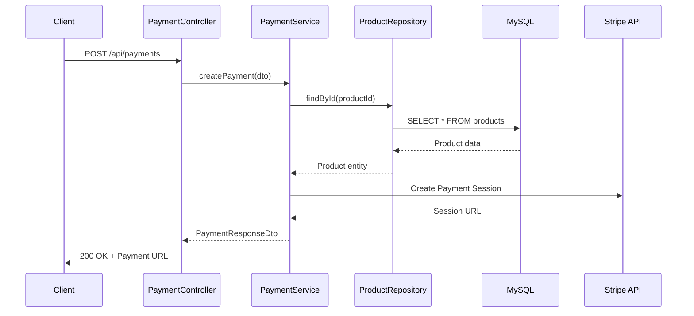

---

### Search Flow

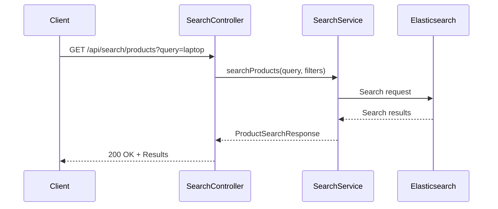

---

## Deployment Architecture

### Docker Compose Deployment

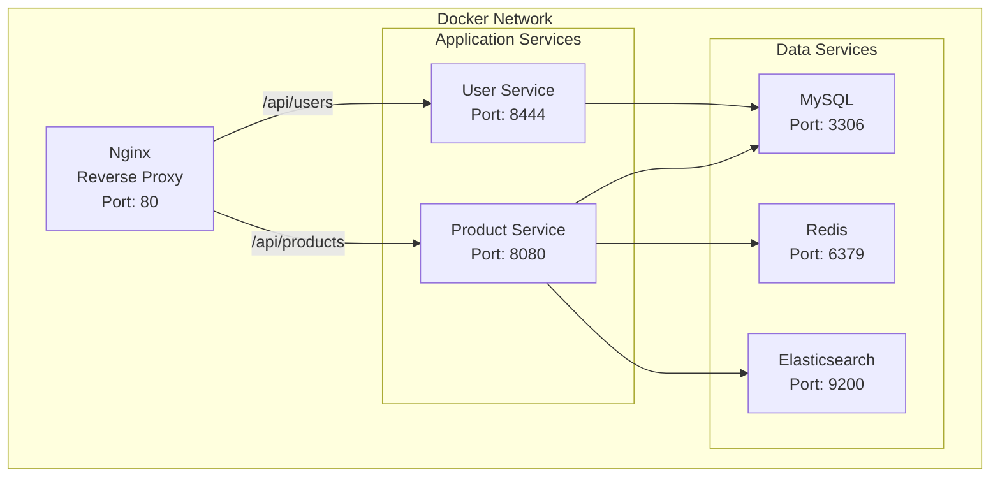

---

### Kubernetes Deployment

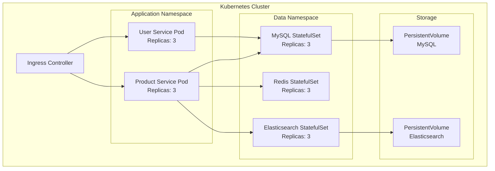

---

## Entity Relationships

### Database Schema

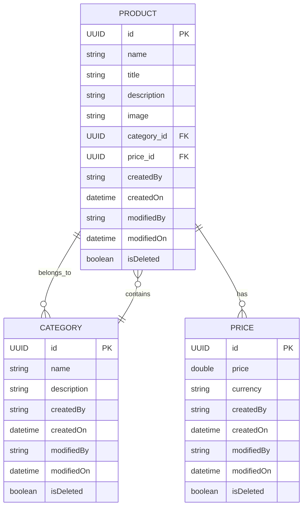

---

## Sequence Diagrams

### OAuth2 Authentication

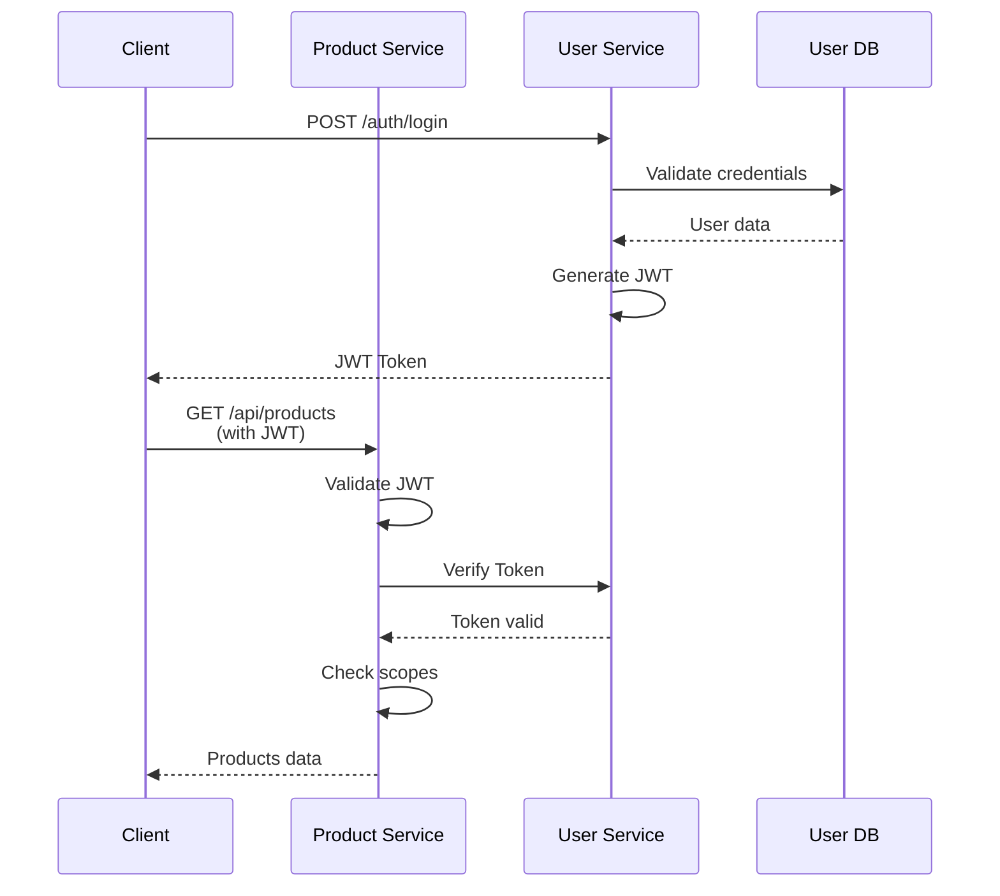

---

### Error Handling Flow

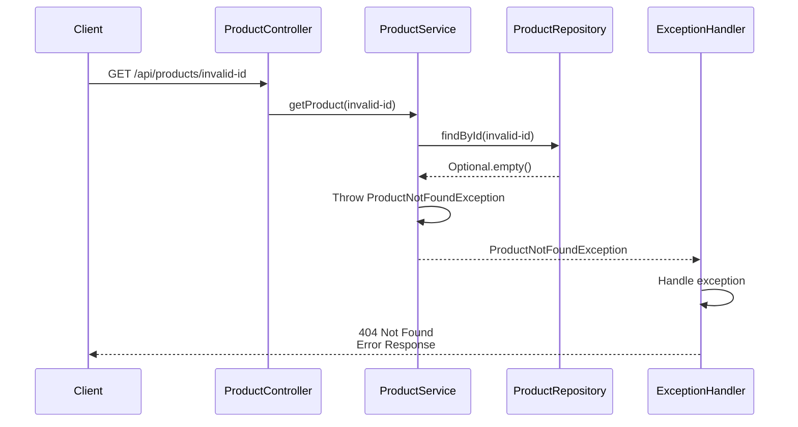

---

## Class Diagrams

### Domain Model

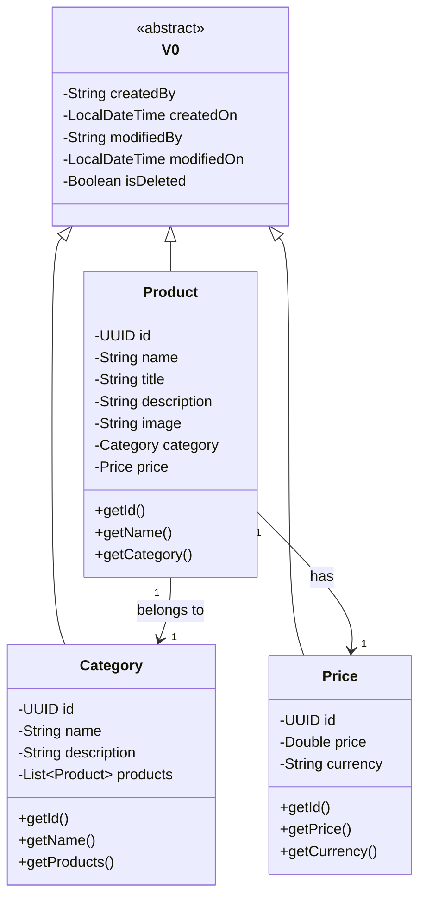

---

### Service Layer

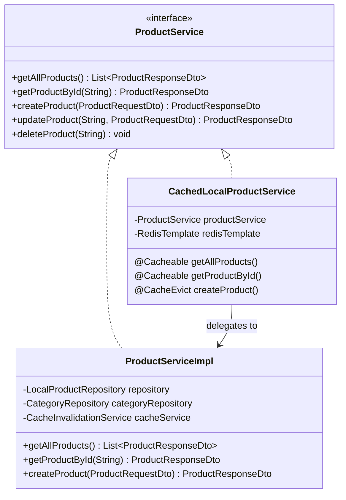

---

### Controller Layer

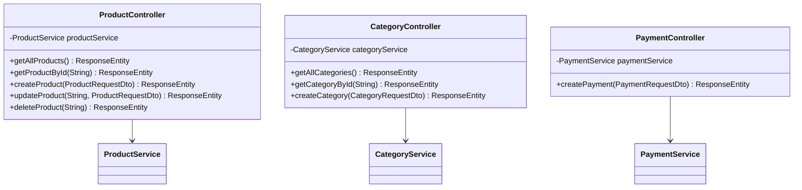

---

## Infrastructure Patterns

### Caching Strategy

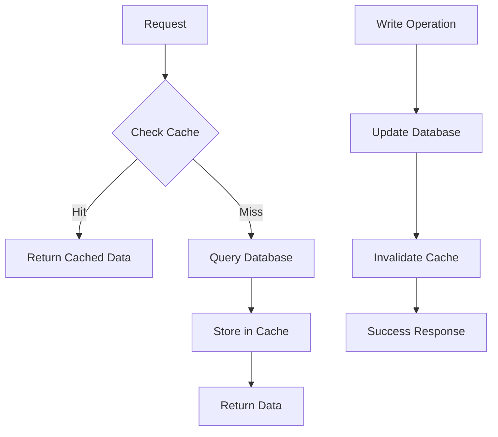

---

### Rate Limiting Strategy

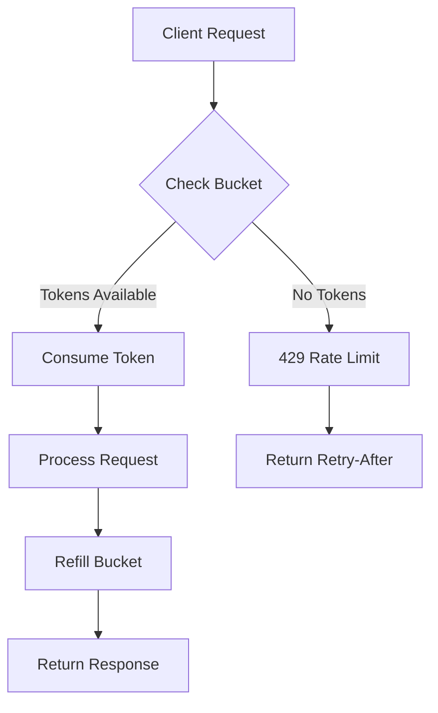

---

## Monitoring & Observability

### Logging Architecture

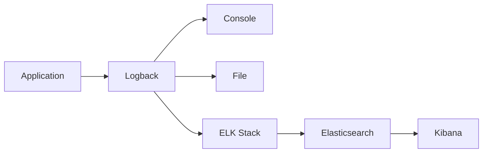

---

### Metrics Collection

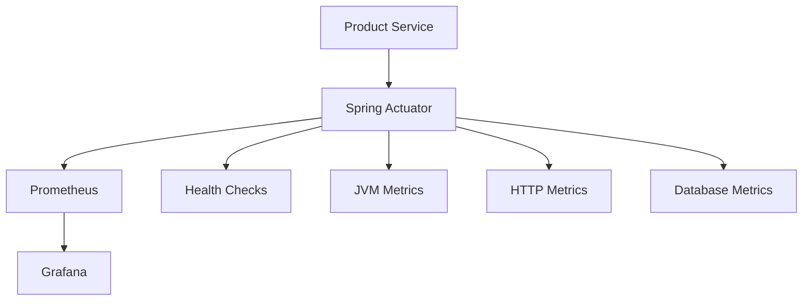

---

## Additional Resources

- **Technical Documentation**: [DOCUMENTATION.md](DOCUMENTATION.md)
- **Quick Start Guide**: [QUICK_START.md](QUICK_START.md)
- **API Specification**: [API_SPECIFICATION.md](API_SPECIFICATION.md)
- **Troubleshooting**: [TROUBLESHOOTING.md](TROUBLESHOOTING.md)
- **Main README**: [README.md](README.md)
